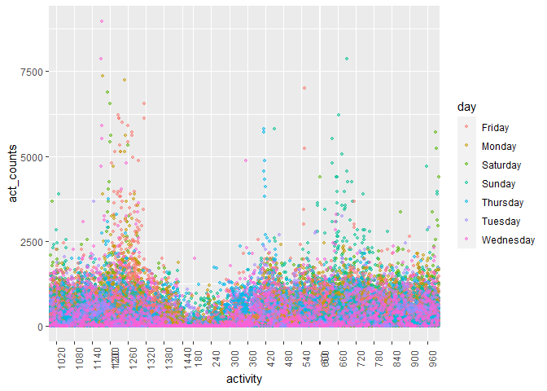

p8105_hw3_yz4433
================
Yifei Zhao
2022-10-13

## Problem 2

### Manipulate data

``` r
data_acc = read_csv(file = "./data/accel_data.csv") %>% 
  janitor::clean_names() %>% 
  add_column(group = "days", .after = "day") %>% 
  mutate(group = ifelse((day == "Saturday" | day == "Sunday"), 'weekend', 'weekday'))
```

    ## Rows: 35 Columns: 1443
    ## ── Column specification ────────────────────────────────────────────────────────
    ## Delimiter: ","
    ## chr    (1): day
    ## dbl (1442): week, day_id, activity.1, activity.2, activity.3, activity.4, ac...
    ## 
    ## ℹ Use `spec()` to retrieve the full column specification for this data.
    ## ℹ Specify the column types or set `show_col_types = FALSE` to quiet this message.

### Table showing totals

``` r
data_acc = data_acc %>%
  add_column(total = rowSums(data_acc[,5:50]), .after = "group")
knitr::kable(data_acc[, 1:5], "simple")
```

| week | day_id | day       | group   |     total |
|-----:|-------:|:----------|:--------|----------:|
|    1 |      1 | Friday    | weekday |  1807.844 |
|    1 |      2 | Monday    | weekday |    46.000 |
|    1 |      3 | Saturday  | weekend |  4525.000 |
|    1 |      4 | Sunday    | weekend |   976.000 |
|    1 |      5 | Thursday  | weekday |  1781.444 |
|    1 |      6 | Tuesday   | weekday |  2207.556 |
|    1 |      7 | Wednesday | weekday |  1582.044 |
|    2 |      8 | Friday    | weekday |  6788.000 |
|    2 |      9 | Monday    | weekday |  7517.000 |
|    2 |     10 | Saturday  | weekend |   544.000 |
|    2 |     11 | Sunday    | weekend |   710.000 |
|    2 |     12 | Thursday  | weekday |  7227.000 |
|    2 |     13 | Tuesday   | weekday |   119.000 |
|    2 |     14 | Wednesday | weekday |   310.000 |
|    3 |     15 | Friday    | weekday |   171.000 |
|    3 |     16 | Monday    | weekday |  2346.000 |
|    3 |     17 | Saturday  | weekend |   961.000 |
|    3 |     18 | Sunday    | weekend |  5861.000 |
|    3 |     19 | Thursday  | weekday |  5601.000 |
|    3 |     20 | Tuesday   | weekday |   193.000 |
|    3 |     21 | Wednesday | weekday |   150.000 |
|    4 |     22 | Friday    | weekday |    46.000 |
|    4 |     23 | Monday    | weekday |  1349.000 |
|    4 |     24 | Saturday  | weekend |    46.000 |
|    4 |     25 | Sunday    | weekend |    46.000 |
|    4 |     26 | Thursday  | weekday | 16688.000 |
|    4 |     27 | Tuesday   | weekday |   266.000 |
|    4 |     28 | Wednesday | weekday |  3385.000 |
|    5 |     29 | Friday    | weekday |   483.000 |
|    5 |     30 | Monday    | weekday |   882.000 |
|    5 |     31 | Saturday  | weekend |    46.000 |
|    5 |     32 | Sunday    | weekend |    46.000 |
|    5 |     33 | Thursday  | weekday |   868.000 |
|    5 |     34 | Tuesday   | weekday |   642.000 |
|    5 |     35 | Wednesday | weekday |   547.000 |

``` r
data_acc = data_acc[,-5] %>% 
  pivot_longer(
    activity_1:activity_1440,
    names_to = "activity", 
    values_to = "act_counts") %>%
  mutate(activity = as.integer(substr(activity, 10, 13)))
```

### Activity plot

``` r
ggplot(data_acc, aes(x = activity, y = act_counts)) + 
  geom_point(aes(color = day), size = 1, alpha = 0.5) +
  scale_x_discrete(labels = c(0, 1440, 60)) +
  theme(axis.text.x = element_text(angle = 90))
```

<!-- -->

## Problem 3

``` r
library(p8105.datasets)
library(patchwork)
data("ny_noaa")
```

### Data cleaning

``` r
ny_noaa = ny_noaa %>% 
  janitor::clean_names() %>% 
  separate(date, into = c("year", "month", "day")) %>% 
  mutate(prcp = as.numeric(prcp)/10, tmax = as.numeric(tmax)/10, tmin = as.numeric(tmin)/10, snow = as.numeric(snow))
```

### temperature plot

#### Jan and July data

``` r
janmax =
  ny_noaa %>%
  drop_na(tmax) %>%
  filter(month == "01")
df_jan = aggregate(tmax ~ id+year, janmax, mean)

julmax =
  ny_noaa %>%
  drop_na(tmax) %>%
  filter(month == "07")
df_jul = aggregate(tmax ~ id+year, julmax, mean)
```

#### plotting

``` r
tmaxjan = 
  df_jan %>% 
  ggplot(aes(x = year, y = tmax, color = id, group = id)) + 
  geom_point(size = 1, alpha = .5) +
  geom_line() +
  theme(axis.text.x = element_text(angle = 90, hjust = 1), axis.title.x = element_text(size = 1)) +
  theme(legend.position = "none")
```

``` r
tmaxjul = 
  df_jul %>% 
  ggplot(aes(x = year, y = tmax, color = id,  group = id)) + 
  geom_point(size = 1, alpha = .5) +
  geom_line() +
  theme(axis.text.x = element_text(angle = 90, hjust = 1), axis.title.x = element_text(size = 1)) +
  theme(legend.position = "none")

tmaxjan/tmaxjul
```

<!-- -->

### tmax vs tmin, and snowfall plotting

``` r
ny_temp = 
  ny_noaa %>% 
  drop_na(tmax) %>% 
  drop_na(tmin) %>% 
  ggplot(aes(x = tmin, y = tmax)) + 
  geom_point(aes(color = year), alpha = .5) +
  theme(legend.position = "bottom", legend.key.size = unit(5, "pt")) +
  # theme(axis.text.x=element_blank())
  theme(axis.text.x = element_text(angle = 90, hjust = 1), axis.title.x = element_text(size = 1))
```

``` r
ny_snow =
  ny_noaa %>%
  filter(snow > 0 & snow < 100) %>% 
  ggplot(aes(x = snow, color = year)) +
  geom_density(alpha = .5) + 
  viridis::scale_fill_viridis(discrete = TRUE) +
  theme(legend.position = "bottom", legend.key.size = unit(5, "pt")) +
  # theme(axis.text.x=element_blank())
  theme(axis.text.x = element_text(angle = 90, hjust = 1), axis.title.x = element_text(size = 1))

ny_temp + ny_snow
```

<!-- -->
